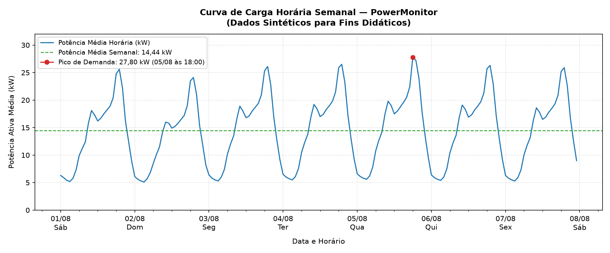
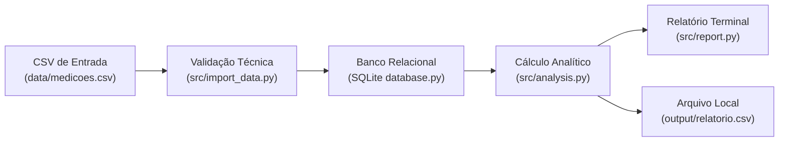

# PowerMonitor: Análise de Consumo e Demanda de Energia Elétrica

[](https://github.com/elycbarros/Power-Monitor/actions/workflows/ci.yml)
[](#5-executar-os-testes-automatizados-e-cobertura)

O **PowerMonitor** é um projeto de portfólio desenvolvido para demonstrar a aplicação integrada de análise de dados, persistência relacional e conceitos práticos de Engenharia Elétrica na avaliação de séries temporais de consumo e demanda de energia.

### Para que serve
O pipeline responde com precisão e auditabilidade a três perguntas essenciais da análise de energia:
1. **Como o consumo elétrico se distribui ao longo do período analisado?**
2. **Em quais momentos a solicitação de potência se concentra e atinge seu pico?**
3. **Quão completos e íntegros são os dados de medição disponíveis?**

### Para quem é
Voltado a estudantes, profissionais recém-formados e analistas interessados em aplicações de dados e tecnologia à Engenharia Elétrica. O foco está no rigor dos contratos de dados, na qualidade das transformações, na correta interpretação física dos resultados e na reprodutibilidade da análise — sem complexidades desnecessárias nem pretensão de atuar como sistema SCADA industrial ou motor de faturamento de concessionária.

### Dados recebidos e resultados entregues
- **Entrada:** Arquivo CSV com registros horários de data/hora local e potência ativa em quilowatts (`data_hora,potencia_kw`).
- **Processamento:** Validação temporal estrita, verificação de finitude numérica, persistência atômica em SQLite com `ROLLBACK` total em divergências e agregações com Pandas.
- **Saídas:** Relatório estruturado no terminal com síntese interpretativa baseada em dados, arquivo local consolidado em `output/relatorio.csv` (com participação percentual de cada dia) e gráfico da curva de carga horária semanal.

### Competências demonstradas
- **Engenharia Elétrica Aplicada:** Conservação dimensional da integral de energia ($E = \int P \, dt$), cálculo do fator de carga e distinção formal entre maior potência média horária e demanda regulada de faturamento.
- **Qualidade e Contratos de Dados:** Ingestão com contrato de hora cheia (`HH:00`), rejeição sem normalização silenciosa de fusos explícitos (`UTC`, `GMT`, offsets, `Z`) e frações de segundo, contabilidade estrita de descarte e detecção de lacunas.
- **Engenharia de Software e SQL:** Persistência relacional idempotente, transações com reversão integral, concordância matemática entre consultas SQL puras e métodos do Pandas, e suíte abrangente de testes automatizados com pytest.

---

## 1. Estudo de Caso Didático

| Etapa | Aplicação Concreta no PowerMonitor |
|---|---|
| **Pergunta** | *“Como o consumo elétrico se distribui ao longo da semana, quando a demanda atinge o pico e quão íntegros são os registros disponíveis?”* |
| **Dados** | Série horária sintética com 168 medições (`data/medicoes.csv`), cobrindo o intervalo de 01/08/2026 00:00 a 07/08/2026 23:00. Dados gerados para fins didáticos, sem lacunas. |
| **Análise** | Validação estrita por linha, persistência no SQLite, cálculo dimensional da energia horária ($\Delta t = 1{,}0\text{ h}$), auditoria de cobertura temporal, fator de carga e desempates determinísticos cronológicos. |
| **Conclusão** | A instalação consumiu **2.426,00 kWh** no período, com potência média de **14,44 kW**. A demanda concentrou-se no dia **05/08/2026**, que registrou simultaneamente o maior consumo diário (**368,60 kWh**, representando 15,19% da energia da semana) e a maior potência média horária (**27,80 kW** às 18:00). O fator de carga de **51,94%** indica um regime de modulação intermediário. A cobertura foi de **100,0%** (168 horas esperadas e medidas no intervalo). |
| **Limitações** | Dados simulados para fins didáticos. O pico de 27,80 kW refere-se à média horária e não à demanda de faturamento regulada (janelas de 15 min). O fator de carga reflete o perfil de uso, não a eficiência física dos equipamentos. A identificação de um pico sugere investigar quais cargas operavam no horário, sem inferir desperdício sem medições setoriais adicionais. |

---

## 2. Demonstração Visual e Resultados Reproduzidos

### Curva de Carga Horária Semanal
A partir do arquivo de exemplo [`data/medicoes.csv`](data/medicoes.csv), a dinâmica de consumo da instalação apresenta o seguinte perfil:



*(Gráfico gerado via [`scripts/gerar_curva_de_carga.py`](scripts/gerar_curva_de_carga.py) com dependências declaradas em [`requirements-dev.txt`](requirements-dev.txt)).*

### Indicadores Consolidados do Exemplo (Configuração Padrão)
Configuração de referência: amostragem regular $\Delta t = 1{,}0\text{ h}$ e tarifa fixa didática de $\text{R\$\ } 0{,}75/\text{kWh}$:

| Indicador | Valor Obtido | Unidade | Interpretação Técnica / Significado Físico |
|---|---|---|---|
| **Medições Válidas** | 168 | Horas | 7 dias civis consecutivos completos de amostragem horária (01/08/2026 a 07/08/2026). |
| **Cobertura Temporal** | 100,0% | % | 168 horas medidas de 168 horas esperadas entre o início da 1ª medição e o fim da última hora. |
| **Potência Média Horária** | 14,44 | kW | Média aritmética da potência ativa demandada pela instalação ao longo da semana. |
| **Demanda Máxima (Pico)** | 27,80 | kW | Maior potência média horária observada, registrada em **05/08/2026 às 18:00**. |
| **Fator de Carga** | 51,94% | % | Razão entre potência média e pico ($14{,}44 / 27{,}80$). Expressa uniformidade, não eficiência. |
| **Dia de Maior Consumo** | 05/08/2026 | Data | Dia de maior consumo registrado (**368,60 kWh**, equivalente a **15,19%** do total registrado). |
| **Energia Consumida Total** | 2.426,00 | kWh | Integral da potência ativa no tempo ($\sum P_i \times 1{,}0\text{ h}$). |
| **Custo Estimado Didático** | 1.819,50 | R$ | Multiplicação linear direta entre energia e tarifa de referência (não equivale a uma fatura real). |

---

## 4. Funcionamento do Pipeline



### Responsabilidade de Cada Módulo:
- **`src/import_data.py`**: Valida a estrutura do CSV, verifica o contrato horário (`minute == 0`, `second == 0`), descarta duplicatas idênticas e identifica lacunas temporais no lote importado.
- **`src/database.py`**: Gerencia a conexão SQLite, cria tabelas e persiste medições garantindo atomicidade com comparação estrita de valores numéricos.
- **`src/analysis.py`**: Contém as funções matemáticas puras para cálculo de potência média, demanda máxima com desempate determinístico e agregações diárias.
- **`src/report.py`**: Formata a exibição no terminal no padrão brasileiro (`1.234,56`), diferenciando novas inserções do histórico total acumulado.
- **`main.py`**: Orquestra o fluxo de ponta a ponta, valida parâmetros globais (`INTERVALO_HORAS == 1.0`), audita lacunas em todo o histórico do banco e controla os códigos de saída do processo.

> **Consultas SQL no Repositório:**  
> O pipeline principal recupera o histórico ordenado via `SELECT data_hora, potencia_kw FROM medicoes ORDER BY data_hora ASC;` e processa as agregações com Pandas. As consultas analíticas completas mantidas em [`sql/queries.sql`](sql/queries.sql) funcionam como exemplos relacionais e são executadas automaticamente pelo teste `test_concordancia_sql_e_pandas_usando_arquivo_queries` para comprovar que SQL e Pandas chegam rigorosamente aos mesmos valores.

---

## 5. Como Executar

### Pré-requisitos
- Python 3.10 ou superior
- Git

### 1. Acessar a pasta do projeto
```bash
cd power-monitor
```

### 2. Criar e ativar o ambiente virtual
```bash
# macOS / Linux:
python3 -m venv .venv
source .venv/bin/activate

# Windows:
python -m venv .venv
.venv\Scripts\activate
```

### 3. Instalar dependências
```bash
# Dependências de produção:
pip install -r requirements.txt

# Para ambiente de desenvolvimento, testes, cobertura e gráficos:
pip install -r requirements-dev.txt
```

### 4. Executar o pipeline
```bash
# Execução padrão (utiliza configurações de config.py):
python main.py

# Execução flexível via CLI (ex: dados em 15 min com tarifa customizada):
python main.py --csv data/medicoes.csv --intervalo 0.25 --tarifa 0.80

# Exibir ajuda e opções de linha de comando:
python main.py --help
```

### 5. Executar os testes automatizados e cobertura
```bash
# Testes com relatório de cobertura por módulo:
pytest -v --cov=src --cov=main --cov-report=term-missing
```

### 6. Gerar a Curva de Carga (Opcional)
```bash
python scripts/gerar_curva_de_carga.py
```

### Arquivos Gerados e Comportamento do Histórico:
- **`database/power_monitor.db`**: Banco de dados SQLite persistente. Reexecuções com os mesmos dados mantêm o histórico inalterado (idempotência). Adicionar novas medições expande o histórico analisado.
- **`output/relatorio.csv`**: Arquivo local sobrescrito a cada execução com o resumo diário consolidado (ignorado pelo Git para manter o repositório limpo).

---

## 6. Premissas de Engenharia e Limitações

### Potência (kW) vs. Energia (kWh)
- **Potência ($P$, em kW):** Taxa instantânea ou média de demanda de energia elétrica durante o intervalo.
- **Energia ($E$, em kWh):** Quantidade física consumida integrada no tempo ($E = \int P \, dt$, com $E = \sum P_i \times \Delta t$).
- O PowerMonitor suporta intervalos amostrais regulares de 1 hora ($\Delta t = 1{,}0\text{ h}$), 30 minutos ($\Delta t = 0{,}5\text{ h}$) e 15 minutos ($\Delta t = 0{,}25\text{ h}$, padrão de concessionárias).

### Contrato Temporal, Lacunas e Dias Incompletos
- **Contrato Temporal:** Cada timestamp indica o início de um intervalo alinhado à grade amostral (`:00` para 1h; `:00` e `:30` para 30 min; `:00`, `:15`, `:30` e `:45` para 15 min). Frações de segundo são rejeitadas sem normalização silenciosa.
- **Potência Negativa:** Valores com $P < 0$ não representam impossibilidade física na natureza (podem decorrer de geração fotovoltaica ou injeção em rede bidirecional), mas estão **fora do escopo de consumo unidirecional do PowerMonitor**, sendo descartados na validação.
- **Lacunas no Histórico:** O sistema audita medições ausentes no CSV e no banco e emite avisos explícitos, **sem preenchimento artificial por zero nem interpolações**.
- **Dias Incompletos:** Dias com amostragem incompleta (ex: menos de 24 medições para 1h ou menos de 96 para 15 min) são sinalizados como parciais no relatório, somando estritamente os intervalos registrados.

### Fator de Carga vs. Eficiência Energética
- O fator de carga reportado ($51{,}94\%$) é a razão entre a potência média ($14{,}44\text{ kW}$) e o pico ($27{,}80\text{ kW}$).
- Ele quantifica a **uniformidade da solicitação de carga no tempo**, não a eficiência física ou rendimento dos equipamentos instalados.

### Demanda de Pico vs. Demanda de Faturamento
- O pico de **27,80 kW** reportado refere-se à **maior potência média observada** no período.
- No faturamento regulado de energia elétrica (concessionárias), a demanda faturável utiliza janelas integradas de 15 minutos e regras contratuais específicas. Com a flag `--intervalo 0.25`, o PowerMonitor agora processa medições nativas nessa resolução de 15 minutos.
- A presença de um pico às 18:00 sugere investigar quais equipamentos ou processos foram acionados no horário, sem inferir desperdício ou falha sem dados setoriais complementares.

### Estimativa Financeira Didática
- O custo reportado (R$ 1.819,50 a R$ 0,75/kWh) é uma estimativa proporcional didática ($E \times \text{tarifa}$).
- Não equivale a uma fatura de energia, pois não inclui demandas contratadas, postos horosazonais (ponta / fora de ponta), bandeiras tarifárias ou tributos (ICMS/PIS/COFINS).

---

## 7. Próximos Passos Priorizados

| Melhoria Proposta | Limitação que Resolve |
|---|---|
| **Ingestão via API REST** | Substitui a dependência exclusiva de arquivos CSV locais por coleta automatizada de medidores IoT. |
| **Simulação Tarifária Horossazonal (Posto Ponta / Fora Ponta)** | Diferenciação de tarifas por faixa horária de acordo com a estrutura tarifária horária regulada (ex: Tarifa Branca / Grupo A). |

---

## 8. Documentação Técnica Complementar

Para aprofundamento técnico sobre o projeto:
- [**Arquitetura do Sistema**](docs/arquitetura.md): Fluxo de dados, persistência transacional e trade-offs técnicos.
- [**Dados e Metodologia**](docs/dados-e-metodologia.md): Dicionário de dados, unidades físicas, regras de validação por linha, formulação matemática e geração da curva de carga.
- [**Validação e Testes**](docs/validacao.md): Como reproduzir os resultados em ambiente isolado, mapa da suíte de testes automatizados e análise crítica de cobertura.
- [**Histórico de Alterações**](CHANGELOG.md): Registro de lançamentos, adições e correções no formato Keep a Changelog.
- [**Especificação do Projeto**](PROJECT_SPEC.md): Requisitos da versão 1.0 e critérios de aceite concluídos.
