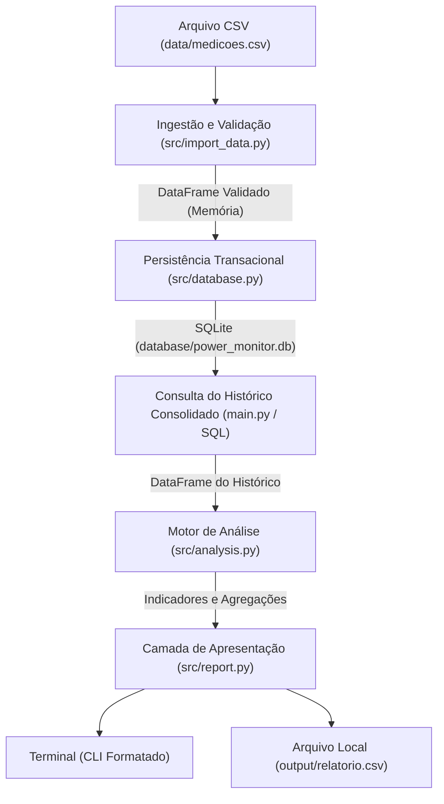

# Arquitetura do Sistema

Este documento descreve a organização modular, o fluxo de dados, a estratégia de persistência e as decisões técnicas observáveis no **PowerMonitor (v1.0)**.

---

## 1. Visão Geral da Arquitetura

O PowerMonitor foi estruturado segundo o princípio de **separação de responsabilidades** (SoC - *Separation of Concerns*). O objetivo é isolar a ingestão e validação, a persistência relacional com garantias de integridade, o motor de cálculo analítico e a camada de apresentação.

A arquitetura do pipeline segue um fluxo determinístico:



---

## 2. Componentes e Responsabilidades Efetivas

| Módulo | Papel Principal | Entradas | Saídas |
|---|---|---|---|
| [`config.py`](../config.py) | Centralização de constantes do projeto via caminhos `pathlib.Path`. Não realiza leitura de variáveis de ambiente. | Constantes definidas no próprio arquivo. | Caminhos de arquivos (`CSV_PATH`, `DATABASE_PATH`, `OUTPUT_PATH`), tarifa fixa de simulação (`TARIFA_KWH = 0.75`) e intervalo amostral (`INTERVALO_HORAS = 1.0`). |
| [`src/import_data.py`](../src/import_data.py) | Ingestão, checagem de tipos, finitude numérica, contrato horário estrito (`HH:00`), descarte de duplicatas idênticas e identificação de lacunas no arquivo CSV. | Caminho do arquivo CSV de medições. | `Tuple[pd.DataFrame, Dict[str, Any]]` contendo dados limpos e relatório de validação mutuamente exclusivo por linha. |
| [`src/database.py`](../src/database.py) | Conexão SQLite com tratamento de erros de sistema de arquivos, DDL de tabelas e persistência transacional atômica com comparação estrita de valores. | Conexão SQLite, DataFrame de medições ou consultas SQL em string. | Inserção idempotente com detecção de conflitos numéricos e consulta de dados como DataFrame. |
| [`src/analysis.py`](../src/analysis.py) | Cálculos vetoriais puros de potência média, demanda de pico com desempate determinístico, consumo diário/total e estimativa linear de custo. | DataFrame com colunas `data_hora` e `potencia_kw`, tarifa e intervalo em horas. | Dicionário de indicadores consolidados e DataFrame diário com sinalização de dias completos/parciais. |
| [`src/report.py`](../src/report.py) | Formatação de saída para terminal com padrão numérico brasileiro e exportação para CSV. | Indicadores calculados, DataFrame diário, estatísticas de linhas do lote e avisos de lacunas do lote e do histórico. | Impressão no terminal padrão e gravação do arquivo local `output/relatorio.csv`. |
| [`main.py`](../main.py) | Orquestrador do pipeline de ponta a ponta: valida parâmetros globais (`INTERVALO_HORAS == 1.0`), coordena ingestão e persistência, audita lacunas no histórico consolidado do banco e gerencia códigos de saída (`exit code`). | Execução direta via terminal (`python main.py`). | Retorno `0` em caso de sucesso ou `1` em caso de falha de validação, integridade, configuração ou I/O. |
| [`sql/queries.sql`](../sql/queries.sql) | Consultas analíticas SQL puras mantidas no repositório para referência e exploração independente. | Banco SQLite `medicoes`. | Conjuntos de resultados analíticos cuja equivalência com o Pandas é verificada via testes automatizados. |

---

## 3. Estratégia de Persistência e Integridade Relacional

### 3.1 Esquema da Tabela (`medicoes`)

O armazenamento relacional utiliza **SQLite**, garantindo portabilidade sem necessidade de configurar servidores externos:

```sql
CREATE TABLE IF NOT EXISTS medicoes (
    id INTEGER PRIMARY KEY AUTOINCREMENT,
    data_hora DATETIME NOT NULL UNIQUE,
    potencia_kw REAL NOT NULL
);
```

- **Restrição `UNIQUE` em `data_hora`**: Garante no nível do banco de dados que não coexistam múltiplos registros para o mesmo instante de tempo.
- **Formato de Carimbo Temporal**: Armazenado como texto no padrão ISO 8601 (`YYYY-MM-DD HH:MM:SS`), preservando ordenação cronológica direta.

### 3.2 Transações Atômicas e Reversão em Conflito

Em vez de utilizar instruções como `INSERT OR REPLACE` (que mascara alterações inadvertidas de dados históricos) ou `INSERT OR IGNORE` (que ignora silenciosamente divergências em medições já existentes), a função `insert_medicoes` em [`src/database.py`](../src/database.py) adota uma política de **validação prévia transacional com comparação estrita**:

1. Inicia um bloco de transação atômica (`with conn:`).
2. Para cada registro recebido, verifica se o timestamp já existe no banco.
3. **Se o timestamp existe com exatamente o mesmo valor numérico de potência**: o registro é ignorado, garantindo **idempotência estrita** em reexecuções.
4. **Se o timestamp existe com qualquer divergência de potência** (inclusive pequenas variações numéricas, como `10.00005 kW` vs `10.0 kW`): o sistema detecta conflito de dados, dispara uma exceção `ValueError` e **aborta a transação inteira (`ROLLBACK`)**. Nenhuma linha do novo lote é gravada no banco.
5. **Se o timestamp for inédito**: é incluído na fila de inserção e persistido atomicamente ao final do lote.

---

## 4. Papel e Divisão de Trabalho: Pandas vs. SQL

1. **Papel do Pandas**:
   - Ingestão flexível e parsing de arquivos CSV;
   - Validação por linha com classificação mutuamente exclusiva, identificando campos nulos, formatos inválidos, frações de segundo e potências negativas;
   - Cálculo ágil de métricas de engenharia elétrica em memória e agrupamentos temporais;
   - Formatação e exportação dos dados consolidados para arquivo local.

2. **Papel do SQLite / SQL**:
   - Camada de persistência relacional local, leve e autocontida;
   - Aplicação de restrições de integridade relacional (`NOT NULL`, `UNIQUE`);
   - Armazenamento cumulativo: o pipeline sempre calcula indicadores sobre todo o histórico persistido no banco, auditando lacunas entre lotes importados em momentos distintos.

3. **Papel de `sql/queries.sql`**:
   - O pipeline em [`main.py`](../main.py) executa a extração do histórico ordenado (`SELECT data_hora, potencia_kw FROM medicoes ORDER BY data_hora ASC;`) e realiza os cálculos em memória com Pandas.
    - O arquivo [`sql/queries.sql`](../sql/queries.sql) reúne consultas analíticas completas (potência média, pico com desempate determinístico, agrupamento diário com participação percentual, resumo consolidado com fator de carga e dia de maior consumo).
    - O teste automatizado `test_concordancia_sql_e_pandas_usando_arquivo_queries` em [`tests/test_analysis.py`](../tests/test_analysis.py) lê diretamente o arquivo `sql/queries.sql`, executa as consultas contra o banco de dados e verifica a concordância matemática com as funções do Pandas (com tolerância absoluta $\le 0{,}01$ para grandezas elétricas e $\le 0{,}05\%$ para o fator de carga percentual).

---

## 5. Decisões de Projeto: Vantagens e Limitações Observáveis

| Decisão | Justificativa e Vantagens | Limitações Observáveis |
|---|---|---|
| **Processamento em memória via Pandas** | Simplicidade de implementação, legibilidade de código e rapidez para séries temporais de tamanho moderado. | Não recomendado para volumes massivos de dados (milhões de registros de telemetria contínua) sem paginação ou processamento em chunks. |
| **Banco SQLite local em arquivo** | Zero configuração de infraestrutura, portabilidade direta e persistência em arquivo único. | Concorrência limitada para múltiplas escritas concorrentes em ambientes distribuídos. |
| **Contrato temporal horário rígido (`HH:00`)** | Evita erros dimensionais na conversão de potência para energia na v1, garantindo que cada amostra represente exatamente 1 hora ($\Delta t = 1{,}0\text{ h}$). | Rejeita medições legítimas em resoluções mais finas (ex: 15 minutos ou 30 minutos) sem agregação prévia. |
| **Rollback total em conflitos de potência** | Segurança de dados: impede que versões contraditórias de telemetria corrompam o histórico sem intervenção humana. | Exige ajuste manual na fonte caso uma concessionária emita uma retificação legítima de dados passados. |
| **Não preenchimento de lacunas (gaps)** | Honestidade de dados: preencher lacunas com zero ou extrapolar dados oculta falhas físicas de medição ou transmissão. | Dias incompletos permanecem com consumo parcial, exigindo auditoria antes de análises de fechamento mensal. |
