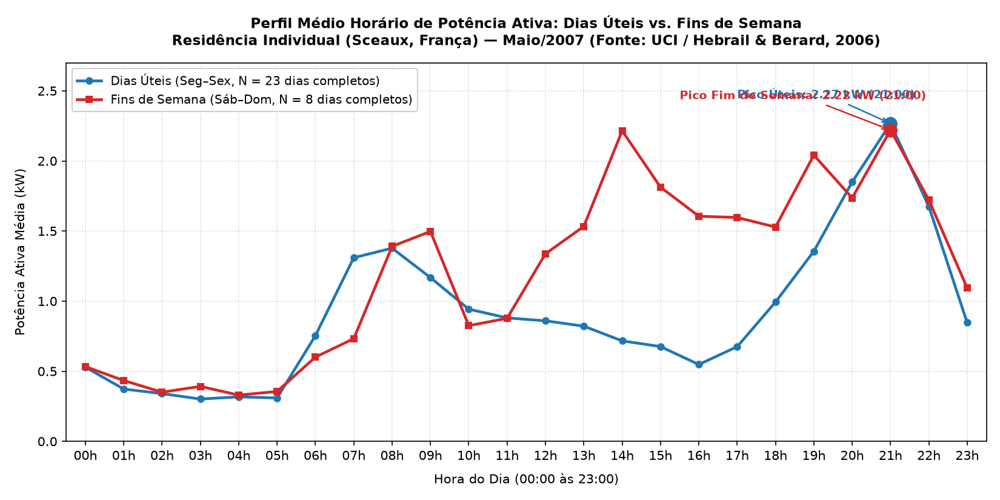
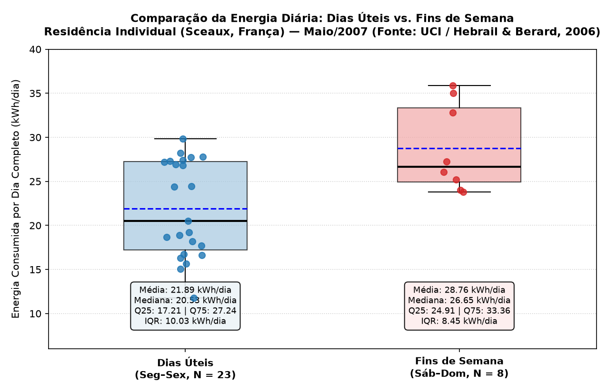

# Estudo de Caso com Dados Reais: Perfil de Consumo em Dias Úteis vs. Fins de Semana

> **Módulo:** Análise Aplicada de Engenharia e Ciência de Dados  
> **Aplicação:** PowerMonitor (Processamento de Séries Temporais Elétricas)  
> **Data de Elaboração:** 19 de setembro de 2026  

---

## Sumário

1. [Pergunta Central de Pesquisa](#1-pergunta-central-de-pesquisa)
2. [Fonte dos Dados, Licença e Recorte Temporal](#2-fonte-dos-dados-licença-e-recorte-temporal)
3. [Auditoria de Qualidade e Política de Saneamento](#3-auditoria-de-qualidade-e-política-de-saneamento)
4. [Metodologia de Comparação Justa](#4-metodologia-de-comparação-justa)
5. [Resultados e Visualizações](#5-resultados-e-visualizações)
6. [Conclusões Sustentadas pelos Dados](#6-conclusões-sustentadas-pelos-dados)
7. [Limitações do Estudo](#7-limitações-do-estudo)
8. [Comandos para Reprodução Integral](#8-comandos-para-reprodução-integral)

---

## 1. Pergunta Central de Pesquisa

> **"Como o perfil de consumo elétrico varia entre dias úteis e fins de semana em um mês de medições residenciais?"**

Em sistemas elétricos de potência e no gerenciamento pelo lado da demanda (DSM), compreender as diferenças de modulação de carga entre dias úteis e fins de semana é essencial para planejamento energético, tarifas horárias e dimensionamento de circuitos. Este estudo de caso utiliza dados reais de medição contínua para quantificar essa variação sem inferências especulativas.

---

## 2. Fonte dos Dados, Licença e Recorte Temporal

### 2.1 Identificação e Citação Oficial
* **Dataset:** *Individual Household Electric Power Consumption*
* **Repositório:** UCI Machine Learning Repository
* **Autores:** Georges Hebrail e Alice Berard (EDF R&D, França)
* **DOI:** [10.24432/C58K54](https://doi.org/10.24432/C58K54)
* **URL Oficial:** [https://archive.ics.uci.edu/dataset/235/individual+household+electric+power+consumption](https://archive.ics.uci.edu/dataset/235/individual+household+electric+power+consumption)
* **Data de Acesso aos Metadados e Dados:** 19 de setembro de 2026
* **Citação Recomendada:**
  > *Hebrail, G. & Berard, A. (2006). Individual Household Electric Power Consumption [Dataset]. UCI Machine Learning Repository. https://doi.org/10.24432/C58K54.*

### 2.2 Termos de Licença e Atribuição
O conjunto de dados é licenciado sob a **Creative Commons Attribution 4.0 International (CC BY 4.0)**, permitindo o compartilhamento, adaptação e redistribuição para qualquer finalidade mediante a atribuição adequada de crédito aos autores e à fonte.

### 2.3 Grandezas, Unidades e Interpretação Metrológica
* **Local de Medição:** Residência unifamiliar localizada em Sceaux (a 7 km de Paris, França).
* **Taxa de Amostragem Original:** 1 minuto (60 segundos) ao longo de 47 meses (dezembro de 2006 a novembro de 2010), totalizando 2.075.259 medições.
* **Variável Principal Utilizada:** `Global_active_power` — potência ativa média por minuto consumida pela residência, expressa em **quilowatts (kW)**.
* **Convenção de Timestamp:** A fonte documenta data no formato `dd/mm/yyyy` e horário `hh:mm:ss`. Como a documentação oficial da UCI não especifica formalmente se o carimbo indica o início ou o término do minuto de integração, adotamos explicitamente a **convenção de início de intervalo** para fins de compatibilidade com o contrato temporal do PowerMonitor.

### 2.4 Regra Explícita de Seleção do Recorte
Para evitar a escolha arbitrária de um mês por motivos visuais ("cherry-picking"), foi estabelecida a seguinte **regra objetiva de seleção**:
1. O período deve corresponder estritamente a **um mês civil completo** (do dia 01 às 00:00 ao último dia às 23:59).
2. Dentre os 47 meses disponíveis, seleciona-se o **primeiro mês cronológico com 100,0% de disponibilidade metrológica**, isto é, com zero registros ausentes (`?`), zero corrupções de formatação e zero duplicatas nos 44.640 minutos esperados.

**Mês Selecionado:** **Maio de 2007 (`2007-05`)**  
* Total de dias: 31 dias civis (23 dias úteis e 8 dias de fim de semana).  
* Minutos esperados: $31 \times 24 \times 60 = 44.640$ minutos.  
* Minutos encontrados válidos: **44.640 (100,0%)**.  
* Minutos ausentes: **0**.  

---

## 3. Auditoria de Qualidade e Política de Saneamento

### 3.1 Política Conservadora de Agregação Horária
Para converter a base de 1 minuto para a resolução horária requerida pelo PowerMonitor ($\Delta t = 1{,}0\text{ h}$), adotou-se uma política estrita:
* **Exigência de 60 minutos válidos:** Uma hora só recebe uma potência média quando possui **exatamente as 60 medições de minuto esperadas**, todas válidas ($P \ge 0$, finitas) e sem timestamps repetidos.
* **Horas Incompletas:** Caso uma hora possuísse 59 minutos ou menos, ela seria sumariamente excluída do conjunto derivado, ficando como lacuna temporal explícita.
* **Não Imputação:** Em nenhuma hipótese medições faltantes são substituídas por zero ou interpoladas artificialmente.

### 3.2 Equivalência Física da Integração de Energia
A energia consumida em cada minuto $m$ com potência média $P_m$ (em kW) é:
$$E_m = P_m \times \left(\frac{1}{60}\right)\text{ kWh}$$

A potência horária integrada calculada pelo PowerMonitor é a média aritmética das 60 amostras:
$$\bar{P}_h = \frac{1}{60} \sum_{m=0}^{59} P_m\text{ (kW)}$$

Multiplicando essa potência média pelo passo horário $\Delta t = 1{,}0\text{ h}$:
$$E_h = \bar{P}_h \times 1{,}0\text{ h} = \sum_{m=0}^{59} \left(P_m \times \frac{1}{60}\right)\text{ kWh}$$

A concordância entre a energia derivada da soma dos minutos e a energia calculada pelo PowerMonitor é exata, com tolerância numérica inferior a $10^{-9}\text{ kWh}$, comprovada via teste automatizado (`tests/test_estudo_caso.py`).

### 3.3 Relatório de Qualidade do Mês de Maio de 2007
| Métrica Metrológica | Valor Apurado | Observação |
|---|---|---|
| **Minutos Esperados no Mês** | 44.640 | $31\text{ dias} \times 24\text{ h} \times 60\text{ min}$ |
| **Minutos Lidos no Arquivo Bruto** | 44.640 | 100% dos minutos presentes |
| **Minutos Válidos ($P \ge 0$, numéricos)** | 44.640 | Nenhum valor negativo ou corrompido |
| **Minutos Ausentes (`?` ou vazios)** | 0 | Ausência de falhas de comunicação |
| **Minutos Duplicados** | 0 | Nenhum timestamp repetido |
| **Horas Esperadas no Mês** | 744 | $31 \times 24$ |
| **Horas Completas (60 min válidos)** | 744 | 100% das horas geradas |
| **Horas Descartadas (< 60 min)** | 0 | Nenhuma perda de intervalo |
| **Dias Civis Completos (24h válidas)** | 31 | Todos os 31 dias têm 24 medições |
| **Dias Parciais (< 24h)** | 0 | Nenhum dia parcial |
| **Cobertura Temporal Mensal Civil** | **100,0%** | Auditoria sobre o calendário completo |
| **Cobertura Temporal no PowerMonitor** | **100,0%** | Entre 01/05/2007 00:00 e 31/05/2007 23:00 |

---

## 4. Metodologia de Comparação Justa

Para que a comparação entre dias úteis e fins de semana seja metodologicamente sólida:

1. **Separação de Grupos sem Inferência de Feriados:**
   * **Dias Úteis:** Segunda-feira a Sexta-feira ($N = 23\text{ dias completos}$).
   * **Fins de Semana:** Sábado e Domingo ($N = 8\text{ dias completos}$).
   * Não foram aplicados calendários de feriados nacionais franceses (ex: 1º e 8 de maio) por ausência de documentação externa verificada no repositório sobre a rotina dos residentes nesses dias específicos.
2. **Normalização por Dia Completo:**
   * É metodologicamente incorreto comparar a energia bruta total (já que 23 dias somam muito mais horas do que 8 dias). A métrica primária é a **Energia Média Diária por Dia Completo (kWh/dia)**.
3. **Métricas de Posição e Dispersão Não Paramétricas:**
   * Como perfis residenciais apresentam assimetria e picos pontuais, além da média aritmética foram calculadas a **Mediana** e o **Intervalo Interquartil (IQR = Q75 - Q25)**.
4. **Alinhamento dos Perfis Médios Horários:**
   * O perfil horário compara a potência média para cada uma das 24 horas do dia ($00\text{h}$ a $23\text{h}$), utilizando estritamente os mesmos 23 dias úteis e 8 fins de semana completos.
5. **Ressalva sobre a Tarifa Simulada:**
   * O PowerMonitor aplica por padrão uma tarifa linear de R$ 0,75/kWh. Esse valor em reais é meramente didático para demonstrar a orquestração do software e **não representa o custo real da residência francesa**, que faturava em Euros sob a estrutura tarifária da Électricité de France (EDF). O foco técnico deste estudo é estritamente o perfil de demanda e consumo físico (kW e kWh).

---

## 5. Resultados e Visualizações

### 5.1 Síntese Executiva Gerada pelo PowerMonitor (Histórico Consolidado)
```text
============================================================================
                      P O W E R M O N I T O R                       
       Análise de Consumo e Demanda de Energia Elétrica (v1.0)       
============================================================================

Total de medições no histórico: 744
Período temporal coberto:       01/05/2007 a 31/05/2007
Cobertura temporal:             744 de 744 horas esperadas (100,0%)

Potência média horária:
  0,99 kW

Maior potência média horária (demanda de pico):
  4,72 kW
Horário da ocorrência de pico:
  08/05/2007 12:00

Fator de carga da instalação:
  20,89%
  (relação potência média / pico; indica uniformidade, não eficiência)

Energia consumida estimada no período:
  733,48 kWh
Dia de maior consumo registrado:
  27/05/2007 (35,90 kWh)
```

---

### 5.2 Comparação Estatística: Dias Úteis vs. Fins de Semana

| Métrica Analítica | Dias Úteis (Seg–Sex) | Fins de Semana (Sáb–Dom) | Variação Relativa |
|---|---|---|---|
| **Tamanho da Amostra ($N$)** | 23 dias completos (552 horas) | 8 dias completos (192 horas) | — |
| **Energia Média Diária** | **21,89 kWh/dia** | **28,76 kWh/dia** | **+31,4%** nos fins de semana |
| **Mediana da Energia Diária** | **20,53 kWh/dia** | **26,65 kWh/dia** | **+29,8%** nos fins de semana |
| **Primeiro Quartil (Q25)** | 17,21 kWh/dia | 24,91 kWh/dia | +44,7% |
| **Terceiro Quartil (Q75)** | 27,24 kWh/dia | 33,36 kWh/dia | +22,5% |
| **Intervalo Interquartil (IQR)** | **10,03 kWh/dia** | **8,45 kWh/dia** | Maior dispersão em dias úteis |
| **Consumo Mínimo Diário** | 11,80 kWh (10/05) | 23,82 kWh (19/05) | +101,9% |
| **Consumo Máximo Diário** | 29,82 kWh (08/05) | 35,90 kWh (27/05) | +20,4% |
| **Pico Médio Horário do Grupo** | 2,27 kW (às 21:00) | 2,22 kW (às 14:00 e 21:00) | Perfil com patamar vespertino |

---

### 5.3 Gráficos Analíticos Gerados

#### Gráfico 1: Perfil Médio Horário de Carga


#### Gráfico 2: Comparação da Distribuição de Energia Diária


---

### 5.4 Detalhamento Horário Médio (kW)

| Hora do Dia | Dias Úteis (kW) | Fins de Semana (kW) | Diferença Absoluta (kW) | Comportamento Observado |
|:---:|:---:|:---:|:---:|---|
| **00:00** | 0,529 | 0,533 | +0,005 | Carga de base noturna idêntica |
| **01:00** | 0,373 | 0,434 | +0,061 | Carga de base |
| **02:00** | 0,341 | 0,351 | +0,010 | Mínimo da madrugada |
| **03:00** | 0,302 | 0,392 | +0,090 | Mínimo da madrugada |
| **04:00** | 0,317 | 0,330 | +0,012 | Mínimo da madrugada |
| **05:00** | 0,309 | 0,356 | +0,047 | Mínimo da madrugada |
| **06:00** | 0,754 | 0,601 | -0,153 | Dias úteis iniciam subida mais cedo |
| **07:00** | **1,310** | 0,732 | **-0,577** | **Pico matutino nos dias úteis** |
| **08:00** | 1,378 | 1,391 | +0,013 | Níveis similares |
| **09:00** | 1,168 | 1,497 | +0,329 | Fim de semana sustentado |
| **10:00** | 0,943 | 0,825 | -0,118 | Redução matinal |
| **11:00** | 0,880 | 0,878 | -0,003 | Estabilidade |
| **12:00** | 0,860 | 1,338 | +0,478 | Almoço: maior elevação no fim de semana |
| **13:00** | 0,821 | 1,533 | +0,711 | Patamar vespertino no fim de semana |
| **14:00** | 0,717 | **2,215** | **+1,498** | **Maior diferença do dia (+209%)** |
| **15:00** | 0,676 | 1,813 | +1,137 | Tarde de fim de semana ativa |
| **16:00** | 0,548 | 1,606 | +1,058 | Tarde de fim de semana ativa |
| **17:00** | 0,675 | 1,596 | +0,921 | Tarde de fim de semana ativa |
| **18:00** | 0,994 | 1,528 | +0,535 | Início do retorno noturno |
| **19:00** | 1,356 | 2,041 | +0,686 | Elevação noturna |
| **20:00** | 1,850 | 1,736 | -0,114 | Preparação para a noite |
| **21:00** | **2,267** | **2,220** | -0,046 | **Pico noturno principal coincidente** |
| **22:00** | 1,675 | 1,722 | +0,047 | Desaceleração noturna |
| **23:00** | 0,846 | 1,094 | +0,248 | Transição para a madrugada |

---

## 6. Conclusões Sustentadas pelos Dados

A análise estritamente quantitativa dos dados de Maio de 2007 permite afirmar com segurança metrológica:

1. **Maior Demanda Energética nos Fins de Semana:**
   * A energia média diária nos fins de semana foi de **$28{,}76\text{ kWh/dia}$**, contra **$21{,}89\text{ kWh/dia}$** nos dias úteis — um incremento significativo de **$+31{,}4\%$** ($+6{,}87\text{ kWh/dia}$). A mediana confirma esse salto ($26{,}65$ vs $20{,}53\text{ kWh/dia}$).
2. **Carga de Base Noturna Equivalente:**
   * Durante a madrugada (01:00 às 05:00), a potência ativa média é estatisticamente indistinguível entre os dois grupos, mantendo-se na faixa de **$0{,}30$ a $0{,}40\text{ kW}$**. Isso reflete o consumo passivo contínuo da residência (geladeira, equipamentos em modo de espera/standby).
3. **Pico Matutino Precoce em Dias Úteis:**
   * Às **07:00**, os dias úteis apresentam demanda média de **$1{,}31\text{ kW}$**, enquanto os fins de semana registram apenas **$0{,}73\text{ kW}$** (diferença de $0{,}58\text{ kW}$, ou $+79\%$ em dias úteis).
4. **Patamar Vespertino Elevado nos Fins de Semana:**
   * A divergência mais expressiva ocorre no período das **12:00 às 18:00**. Enquanto nos dias úteis a potência média da tarde oscila em patamares baixos ($0{,}55$ a $0{,}86\text{ kW}$), nos fins de semana ela atinge **$2{,}22\text{ kW}$ às 14:00**, sustentando médias acima de $1{,}50\text{ kW}$ durante toda a tarde.
5. **Convergência no Horário Nobre Noturno (21:00):**
   * Ambos os grupos atingem seu pico noturno exatamente às **21:00**, com valores médios praticamente idênticos: **$2{,}27\text{ kW}$ em dias úteis** e **$2{,}22\text{ kW}$ nos fins de semana**.
6. **Dispersão e Assimetria:**
   * Os dias úteis exibem maior variabilidade relativa de consumo (IQR de **$10{,}03\text{ kWh/dia}$**, variando de $11{,}80$ a $29{,}82\text{ kWh/dia}$), enquanto os fins de semana apresentam um piso mais rígido (mínimo de $23{,}82\text{ kWh/dia}$ e IQR de $8{,}45\text{ kWh/dia}$).

---

## 7. Limitações do Estudo

Para manter o rigor de engenharia perante avaliadores técnicos, as seguintes limitações devem ser explicitadas:

1. **Amostra Estritamente Unitária (N = 1 Residência):**
   * Os dados refletem as medições de uma única residência em uma cidade específica da França (Sceaux). Os resultados **não podem ser extrapolados** como regra geral para residências brasileiras ou padrões médios da população.
2. **Ausência de Covariáveis Ambientais e Comportamentais:**
   * Não dispomos de registros oficiais sobre o número de moradores presentes em cada dia, rotina de home office, viagens ou temperatura externa/graus-dia de aquecimento (HDD/CDD). Portanto, **não é permitido afirmar causalidade** (por exemplo, atribuir a elevação das 14h nos fins de semana a ar-condicionado, cozimento ou lavanderia sem medições setoriais comprovadas).
3. **Tamanho Amostral de Fins de Semana ($N = 8$):**
   * Em um mês civil de 31 dias, há 23 dias úteis e apenas 8 dias de fim de semana (4 sábados e 4 domingos). Embora represente 100% da população temporal daquele mês, a amostra de fins de semana é estatisticamente pequena para testes de hipótese complexos.
4. **Fator de Carga Global Baixo ($20{,}89\%$):**
   * O fator de carga mensal apurado pelo PowerMonitor foi de $20{,}89\%$, resultante de uma potência média de $0{,}99\text{ kW}$ frente a um pico isolado de $4{,}72\text{ kW}$ no dia 08/05 às 12:00. Isso é típico do perfil residencial (altos picos de curta duração e baixa demanda média), mas não reflete problemas de eficiência dos aparelhos.

---

## 8. Comandos para Reprodução Integral

O estudo pode ser 100% reproduzido a partir dos scripts versionados no repositório:

### 1. Obter e Processar o Mês de Maio/2007 (UCI)
```bash
python3 scripts/preparar_estudo_caso_uci.py
```
*Gera o arquivo horário saneado:* `data/medicoes_uci_2007_05.csv` (744 linhas).

### 2. Executar o PowerMonitor sobre os Dados Reais
```bash
python3 main.py --csv data/medicoes_uci_2007_05.csv --banco database/estudo_caso.db --saida output/relatorio_estudo_caso.csv
```
*Gera o laudo no terminal, o banco SQLite persistente `database/estudo_caso.db` e a exportação diária `output/relatorio_estudo_caso.csv`.*

### 3. Gerar os Gráficos Comparativos
```bash
python3 scripts/analisar_estudo_caso_graficos.py
```
*Salva as figuras:*
* `docs/images/estudo_caso_perfil_horario.png`
* `docs/images/estudo_caso_energia_diaria.png`

### 4. Executar os Testes Automatizados
```bash
pytest -v tests/test_estudo_caso.py
```
*Valida o saneamento, tolerâncias de energia e classificação temporal.*
